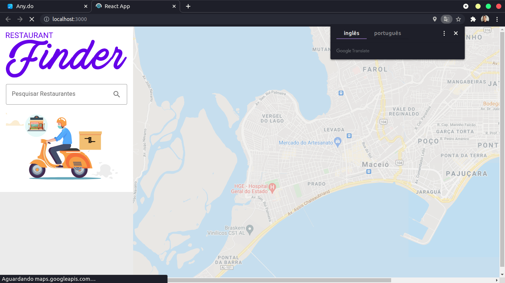
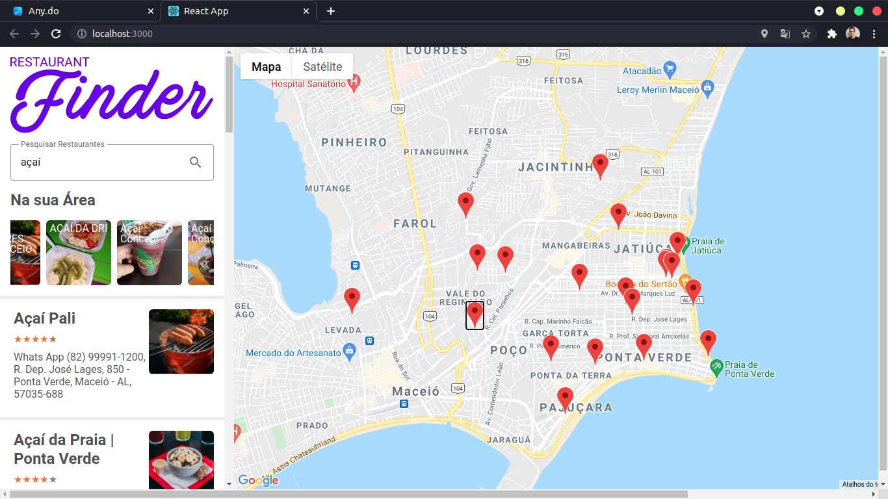
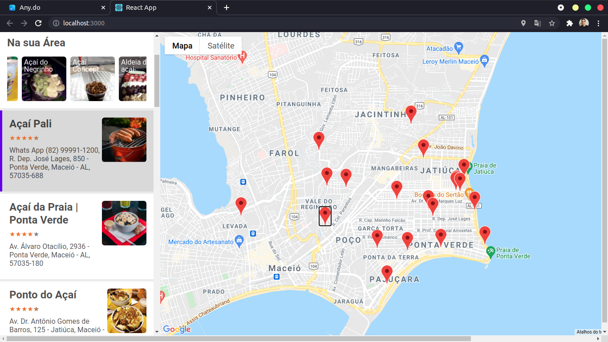
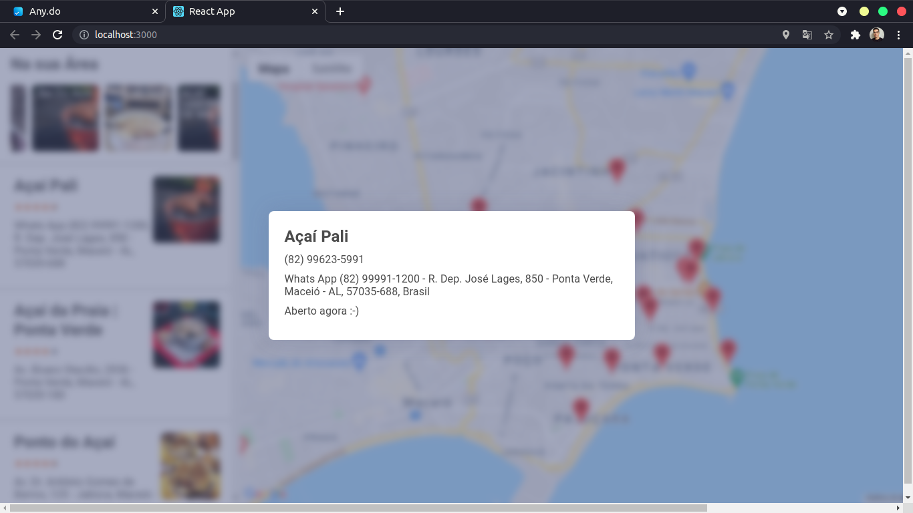

<div align="center">
    
</div>

<br/>

> O projeto é um buscador de restaurantes e lanchonetes que utiliza da api de maps e places da google para realizar as buscas dos estabelecimentos com a localização do usuário.

---

<br/>

# :pushpin: Índice

<p align="left">
    <ul>
        <li><a href="#rocket-tecnologias">Tecnologias</a></li>
        <li><a href="#information_source-como_usar">Como usar</a></li>
        <li><a href="#iphone-layout">Layout</a></li>
    </ul>
</p>

<br/>

# :rocket: Tecnologias

- [React](https://pt-br.reactjs.org/)
- [Styled Components](https://styled-components.com/)
- [Redux](https://redux.js.org/)
- [Maps JavaScript API (Google)](#)
- [Places API (Google)](#)

<br/>

# :information_source: Como usar

```bash
# Clone este repositório:
$ git clone https://github.com/JonataRamalho/restaurants-search.git

# Vá para o repositório:
$ cd restaurants-search/

# Instale as dependências:
$ yarn install

# Inicie o React:
$ yarn start
```

<br/>

# :iphone: Layout

<p align="center">
    &nbsp;&nbsp;&nbsp;
    <br/>
    <br/>
    
    <br/>
    <br/>
    
    <br/>
    <br/>
    
</p>
